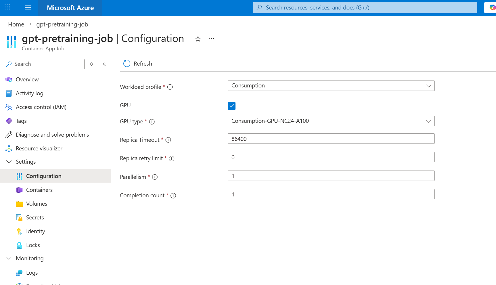
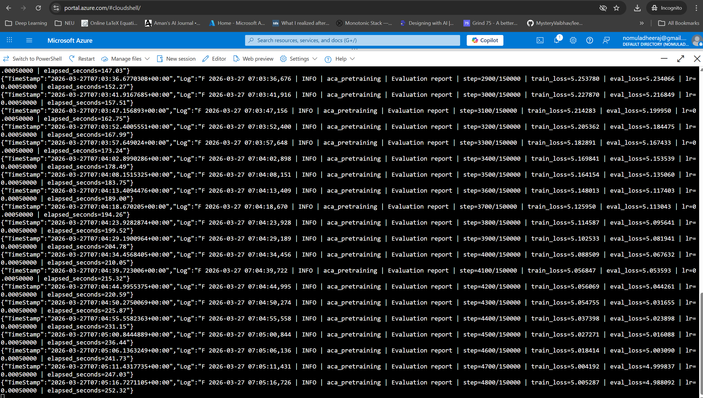
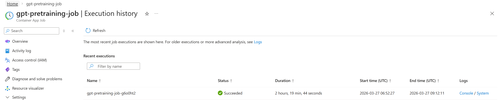
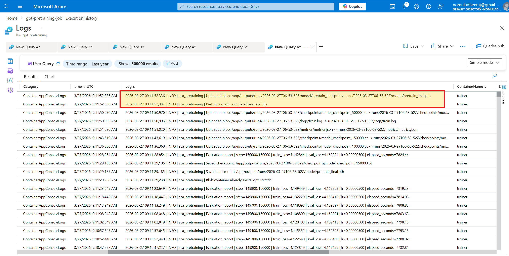

# ACA Pretraining Job

This folder contains a production-style refactor of the notebook training workflow from `notebooks/gpt-from-scratch.ipynb` into a batch-friendly Python project for Azure Container Apps Jobs.

## What it does

- Loads or generates local tokenized parquet files from `cnn_dailymail`
- Builds the same GPT-style model used in the notebook
- Trains with the same next-token prediction objective
- Evaluates on a fixed interval
- Saves checkpoints and a final model under a timestamped run directory
- Writes logs to both stdout and a local text file
- Uploads the full run directory to Azure Blob Storage
- Fails fast if a GPU is required but CUDA is not available inside the container

## Project structure

```text
aca_pretraining/
  __init__.py
  blob_utils.py
  data_utils.py
  modeling.py
  pretraining.py
  download_latest_blob_run.ipynb
  requirements.txt
  Dockerfile
  .dockerignore
  README.md
  create-aca-gpu-job.ipynb
  images/
```

## Local usage

From the repository root:

```powershell
python -m venv .venv
.\.venv\Scripts\activate
pip install -r aca_pretraining/requirements.txt
python aca_pretraining/pretraining.py
```

The script creates a run directory like:

```text
outputs/runs/2026-03-27T12-00-00Z/
```

Inside that run directory you will find:

- `logs/train.log`
- `checkpoints/model_checkpoint_<step>.pt`
- `model/pretrain_final.pth`
- `metrics/metrics.json`

The most useful first file to inspect after a run is `logs/train.log`. It contains:

- startup config
- CUDA / GPU detection details
- evaluation reports
- checkpoint saves
- Blob upload activity

## Configuration

All user-editable constants live at the top of `aca_pretraining/pretraining.py` under the `# CONFIG` section.

That includes:

- dataset paths
- training row counts
- batch size
- sequence length
- number of training steps
- evaluation frequency
- checkpoint frequency
- learning rate and scheduler settings
- model depth, head count, and embedding size

The script supports two built-in config profiles controlled by `RUN_MODE`:

- `RUN_MODE = "smoke"` for fast end-to-end validation
- `RUN_MODE = "full"` for the larger notebook-style pretraining run

The current checked-in config is set to `full`. If you want the earlier tiny validation run again, switch `RUN_MODE` back to `smoke`.

The most important values controlled by the active config profile are:

- `TRAIN_ROWS`
- `TEST_ROWS`
- `BATCH_SIZE`
- `NUM_STEPS`
- `EVAL_INTERVAL_STEPS`
- `CHECKPOINT_INTERVAL_STEPS`
- `MODEL_N_LAYER`
- `MODEL_N_HEAD`
- `MODEL_N_EMBD`

## Checkpoint resume

The training script can resume automatically from the latest checkpoint in the current run directory when `RESUME_FROM_LATEST_CHECKPOINT = True`.

It restores:

- model weights
- optimizer state
- scheduler state
- last saved step

Startup logs explicitly state whether a checkpoint was found and resumed.

## Blob Storage

Blob configuration is loaded from a `.env` file. Secrets are not hardcoded.

Required `.env` variables:

- `AZURE_STORAGE_CONNECTION_STRING`
- `AZURE_BLOB_CONTAINER`

Artifacts are uploaded under a timestamped prefix like:

```text
runs/<timestamp>/logs/train.log
runs/<timestamp>/checkpoints/model_checkpoint_50000.pt
runs/<timestamp>/model/pretrain_final.pth
runs/<timestamp>/metrics/metrics.json
```

If upload fails, the local files remain on disk.

## Downloading the latest run from Blob

After an ACA run finishes, you can download the newest uploaded run back to your machine with:

- [download_latest_blob_run.ipynb](C:/Users/deril/OneDrive/Desktop/Deril/Development/Transformers-From-Scratch/aca_pretraining/download_latest_blob_run.ipynb)

The notebook:

- loads `AZURE_STORAGE_CONNECTION_STRING` and `AZURE_BLOB_CONTAINER` from `.env`
- lists blobs under `runs/`
- detects the latest run timestamp automatically
- downloads the full run into `aca_pretraining/model_run/`

The downloaded folder keeps the same structure as Blob:

- `model_run/checkpoints/`
- `model_run/logs/`
- `model_run/metrics/`
- `model_run/model/`

This is the easiest way to pull down the latest ACA artifacts for local inspection, plotting, or later inference work.

Start with:

- `model_run/logs/train.log`

That log file is the best single place to verify ACA runtime details such as:

- whether the job saw CUDA
- which GPU Azure attached
- training progress and eval loss
- checkpoint and final artifact saves

## ACA GPU deployment

This project has been validated end-to-end on Azure Container Apps GPU Jobs with:

- public image: `docker.io/deril2605/gpt-pretraining-smoke:latest`
- workload profile: `Consumption-GPU-NC24-A100`
- GPU detected in runtime logs as `NVIDIA A100 80GB PCIe`
- successful checkpoint, final-model, metrics, and Blob uploads from ACA

The recommended deployment path for this repo is:

- push the Docker image to public Docker Hub
- use [create-aca-gpu-job.ipynb](create-aca-gpu-job.ipynb) to create or update the ACA environment and job
- run the job manually from the notebook or Azure Portal
- validate GPU attachment from startup logs

### Validated ACA setup

The working Azure setup for this project uses:

- ACA Job image: `docker.io/deril2605/gpt-pretraining-smoke:latest`
- workload profile: `Consumption-GPU-NC24-A100`
- CPU / memory: `24 vCPU`, `220Gi`
- runtime GPU: `NVIDIA A100 80GB PCIe`
- artifact persistence: Azure Blob Storage uploads at the end of the run

This was validated with a real ACA execution, not just local Docker testing.

Important ACA details for this project:

- the job should use `Consumption-GPU-NC24-A100` if your region and quota support it
- the container is configured to fail fast if `torch.cuda.is_available()` is `False`
- the ACA creation notebook pins authentication to `AZURE_TENANT_ID`
- the ACA creation notebook creates or reuses a Log Analytics workspace and wires it into the Container Apps Environment so Portal log links work
- Blob upload remains the durable source of truth for artifacts, even if Portal log UX is inconsistent

GPU validation in ACA should show log lines like:

```text
Device detected: cuda
Torch version: 2.9.1+cu128
Torch CUDA runtime version: 12.8
CUDA available: True
Detected GPU: NVIDIA A100 80GB PCIe
```

If `CUDA available: False`, the job exits immediately instead of silently falling back to CPU.

Portal and Cloud Shell notes:

- Azure Portal often shows ACA Job logs in a table-style execution log view rather than a true terminal-style live stream
- for closer-to-live streaming, Azure Cloud Shell can use:

```bash
az containerapp job logs show -g <resource-group> -n <job-name> --container trainer --follow --tail 50
```

The ACA creation notebook expects these `.env` values:

- `AZURE_SUBSCRIPTION_ID`
- `AZURE_TENANT_ID`
- `AZURE_RESOURCE_GROUP`
- `AZURE_LOCATION`
- `AZURE_CONTAINERAPPS_ENV_NAME`
- `AZURE_CONTAINERAPP_JOB_NAME`
- `AZURE_GPU_PROFILE_NAME`
- `AZURE_LOG_ANALYTICS_WORKSPACE_NAME`
- `ACA_JOB_IMAGE`
- `ACA_JOB_CPU`
- `ACA_JOB_MEMORY`
- `AZURE_STORAGE_CONNECTION_STRING`
- `AZURE_BLOB_CONTAINER`

Recommended defaults for the validated setup:

- `AZURE_GPU_PROFILE_NAME=Consumption-GPU-NC24-A100`
- `AZURE_LOG_ANALYTICS_WORKSPACE_NAME=law-gpt-pretraining`
- `ACA_JOB_IMAGE=docker.io/deril2605/gpt-pretraining-smoke:latest`
- `ACA_JOB_CPU=24`
- `ACA_JOB_MEMORY=220Gi`

### ACA screenshots

GPU workload profile selection:



Job configuration / run view:



Completed execution in the Portal:



Execution logs in the Portal:



Microsoft docs:

- https://learn.microsoft.com/en-us/azure/container-apps/jobs
- https://learn.microsoft.com/en-us/azure/container-apps/jobs-get-started-cli
- https://learn.microsoft.com/en-us/azure/container-apps/workload-profiles-overview
- https://learn.microsoft.com/en-us/azure/container-apps/gpu-serverless-overview
- https://learn.microsoft.com/en-us/azure/templates/microsoft.app/2025-01-01/jobs

## Rough cost estimate

This is only a planning estimate, not actual Azure billing.

Observed full-run behavior during validation:

- workload profile: `Consumption-GPU-NC24-A100`
- GPU detected: `NVIDIA A100 80GB PCIe`
- full training config runtime estimate: about `2.2 hours` for `150,000` steps

Using the rough A100 hourly estimate discussed during setup:

- approximately `$8 to $12` per full run

Using your conversion assumption of `1 USD = 94 INR`:

- approximately `INR 752 to INR 1,128` per full run
- simple planning number: about `INR 950 per run`

Treat this as a ballpark estimate only. Actual Azure charges can differ based on:

- the exact ACA GPU pricing model in your region
- Log Analytics ingestion
- Blob storage usage
- runtime variation between runs
- any platform-side billing overhead

## Docker build

Build from the repository root:

```powershell
docker build -t gpt-pretraining:latest aca_pretraining
```

## Important fixes from the notebook

- The notebook's `accumulation_steps` variable was not doing gradient accumulation; it was only controlling evaluation and reporting cadence. The script renames that behavior to `EVAL_INTERVAL_STEPS` to avoid confusion while preserving the workflow.
- The model is always moved explicitly to `cuda` when available, otherwise `cpu`.
- The script logs GPU count and total GPU memory at startup, in addition to the detected GPU name.
- Outputs are written into a timestamped run directory so concurrent or repeated runs do not overwrite each other.
- Checkpoints save optimizer, scheduler, and model state for safer batch recovery and artifact upload.
- The script can resume from the latest checkpoint automatically.
- Failures log stack traces and attempt a best-effort artifact upload before exit.
- The Docker image now uses the official prebuilt PyTorch CUDA runtime image, which avoids reinstalling the huge CUDA-enabled `torch` wheel on every build and makes rebuilds much faster.
