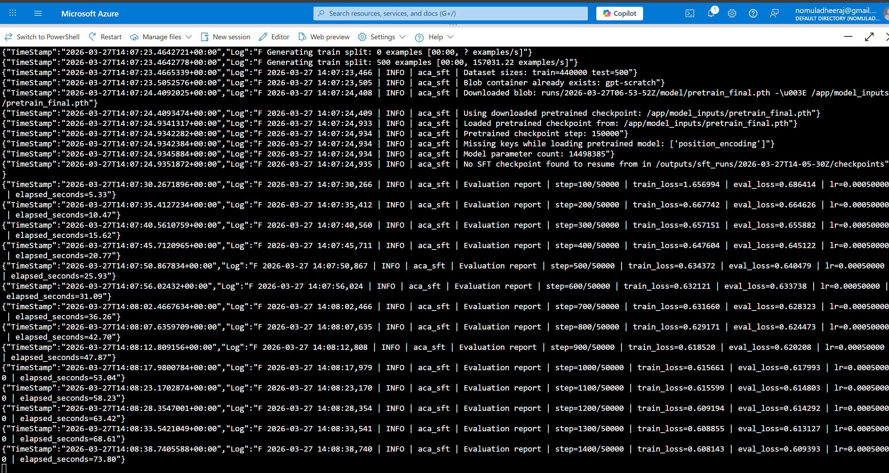
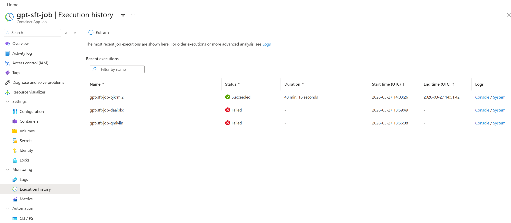

# ACA SFT Job

This folder contains a production-style supervised fine-tuning project for Azure Container Apps Jobs. It follows the same debugging and deployment lessons as `aca_pretraining/`, but runs the Q&A supervised fine-tuning stage as an independent job.

## What it does

- loads or generates tokenized `fact_qa` parquet files from `rubenroy/GammaCorpus-Fact-QA-450k`
- loads a pretrained GPT checkpoint as the SFT starting point
- fine-tunes with the same next-token objective used in the notebook
- logs to both stdout and `logs/train.log`
- saves checkpoints, metrics, and the final `sft_final.pth`
- uploads the whole run directory to Azure Blob Storage
- fails fast if CUDA is not available

## Project structure

```text
aca_sft/
  __init__.py
  blob_utils.py
  data_utils.py
  modeling.py
  sft.py
  download_latest_sft_blob_run.ipynb
  create-aca-sft-job.ipynb
  requirements.txt
  Dockerfile
  .dockerignore
  README.md
```

## Local usage

From the repository root:

```powershell
python -m venv .venv
.\.venv\Scripts\activate
pip install -r aca_sft/requirements.txt
python aca_sft/sft.py
```

The script writes outputs under:

```text
outputs/sft_runs/<timestamp>/
```

Inside each run:

- `logs/train.log`
- `checkpoints/sft_model_checkpoint_<step>.pt`
- `model/sft_final.pth`
- `metrics/metrics.json`

Start with `logs/train.log` when you want to verify:

- ACA GPU / CUDA detection
- dataset sizes
- eval progress
- checkpoint saves
- Blob uploads

## Configuration

All user-editable constants live at the top of `aca_sft/sft.py` under `# CONFIG`.

Important SFT settings include:

- `RUN_MODE`
- `TRAIN_ROWS`
- `TEST_ROWS`
- `BATCH_SIZE`
- `NUM_STEPS`
- `EVAL_INTERVAL_STEPS`
- `CHECKPOINT_INTERVAL_STEPS`
- `TRAIN_PARQUET_PATH`
- `TEST_PARQUET_PATH`
- `LOCAL_PRETRAINED_CHECKPOINT_PATH`
- `PRETRAINED_MODEL_BLOB_PATH`

The script supports:

- `RUN_MODE = "smoke"` for quick end-to-end validation
- `RUN_MODE = "full"` for the notebook-scale SFT run

The current checked-in mode is `full`.

## Pretrained model input

This SFT job is designed to run independently from pretraining.

It resolves the pretrained checkpoint in this order:

1. local file at `LOCAL_PRETRAINED_CHECKPOINT_PATH`
2. Blob download from `PRETRAINED_MODEL_BLOB_PATH`

So you can either:

- place `pretrain_final.pth` in `model_inputs/`
- or set `PRETRAINED_MODEL_BLOB_PATH` to the Blob path of a pretraining artifact

Example Blob path:

```text
runs/2026-03-27T06-53-52Z/model/pretrain_final.pth
```

The loader reconstructs the GPT model from the saved config and loads the saved `model_state_dict`, which matches the checkpoint format produced by `aca_pretraining/pretraining.py`.

## Blob Storage

The script uses the same env-based Blob config pattern as pretraining.

Required `.env` variables:

- `AZURE_STORAGE_CONNECTION_STRING`
- `AZURE_BLOB_CONTAINER`

SFT artifacts upload under:

```text
runs/sft/<timestamp>/logs/train.log
runs/sft/<timestamp>/checkpoints/sft_model_checkpoint_25000.pt
runs/sft/<timestamp>/model/sft_final.pth
runs/sft/<timestamp>/metrics/metrics.json
```

If upload fails, local artifacts stay on disk.

## Downloading the latest SFT run from Blob

After an ACA SFT run finishes, you can download the latest uploaded run with:

- [download_latest_sft_blob_run.ipynb](C:/Users/deril/OneDrive/Desktop/Deril/Development/Transformers-From-Scratch/aca_sft/download_latest_sft_blob_run.ipynb)

By default, the notebook skips checkpoint blobs and downloads only:

- `model_run/logs/train.log`
- `model_run/metrics/metrics.json`
- `model_run/model/sft_final.pth`

If you need checkpoints too, set `INCLUDE_CHECKPOINTS = True` inside the notebook.

## ACA deployment notes

This project is meant to reuse the same ACA GPU environment pattern validated in `aca_pretraining/`.

Recommended setup:

- same ACA Environment
- same GPU workload profile: `Consumption-GPU-NC24-A100`
- separate ACA Job, for example `gpt-sft-job`
- same public image pattern, but built from `aca_sft/Dockerfile`

Use this deployment notebook to create or update the SFT job without recreating the existing ACA environment:

- [create-aca-sft-job.ipynb](C:/Users/deril/OneDrive/Desktop/Deril/Development/Transformers-From-Scratch/aca_sft/create-aca-sft-job.ipynb)

The job should emit startup log lines like:

```text
Device detected: cuda
Torch version: 2.9.1+cu128
Torch CUDA runtime version: 12.8
CUDA available: True
Detected GPU: NVIDIA A100 80GB PCIe
```

If CUDA is unavailable, the container exits immediately.

## Important fixes carried over

- explicit `.to(device)` handling
- CUDA fail-fast behavior
- stdout + file logging
- crash checkpoint save on failure
- best-effort Blob upload after failure
- robust `HF_HUB_ENABLE_HF_TRANSFER` disabling for notebook / container environments
- checkpoint-style pretrained model loading instead of `torch.load(full_model_object)`
- fixed checkpoint cadence logic using real modulo checks

### Screenshots

SFT job configuration / run view:



SFT execution view in the Portal:


