# Transformers Explained

# Building a Simple GPT-Style Q&A LLM from Scratch

*A good resource to use alongside this notebook is the original [GPT paper](https://cdn.openai.com/research-covers/language-unsupervised/language_understanding_paper.pdf) [1]. This notebook largely relies on that paper for model architectures and implementation.*

This article will walk through building a simple GPT style model from scratch using pytorch [1,2]. The goal of this article is to train a basic large language model from start to finish in one notebook. We will train an LLM that is small enough to fit in a single GPU during training and inference, so the notebook can be run in popular cloud GPU services (Google Colab, Kaggle, Paperspace, etc...). The computation graph of the model that we will build in this article is as follows:

  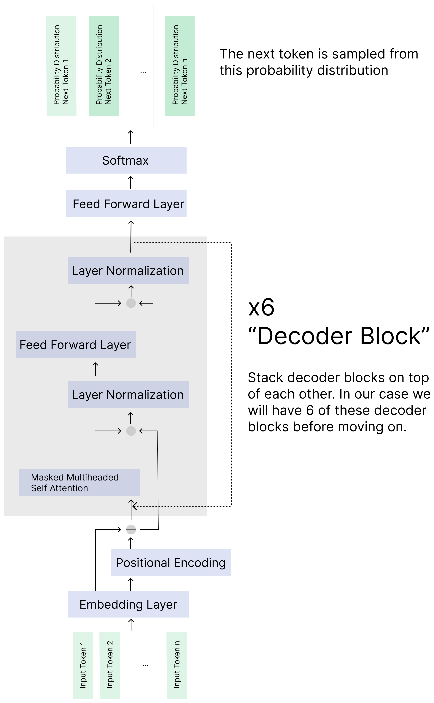

This architecture resembles the original [GPT](https://cdn.openai.com/research-covers/language-unsupervised/language_understanding_paper.pdf) model, and is quite similar to [GPT2](https://cdn.openai.com/better-language-models/language_models_are_unsupervised_multitask_learners.pdf) and [GPT3](https://arxiv.org/pdf/2005.14165), with the main difference being that it is smaller (less decoder blocks and smaller embedding sizes) [1,3,4]. We will zoom into each step of this diagram throughout this article to discuss the math, code, and intuition behind them. 

According to the original GPT paper, there are two main training stages for the early GPT models, **pretraining** and **supervised fine tuning** [1]. Pretraining is a self supervised learning task, where parts of the input data are omitted and used as target variables. Self supervised fine tuning works similar to traditional supervised learning tasks, with human annoted labels for input data.

# 1: Pretraining   
The first stage in building a GPT model is pretraining. Pretraining builds the "base" of an LLM. It allows the model to understand statistical properties of language, grammar, and context. 

#### Pretraining Goal 

The goal of pretraining is simple: **to have a model that can reliably predict the next token given the previous k tokens in a sequence**. The final result of pretraining is a deep learning model that takes in $k$ tokens and produces a discrete probability distribution of what the $k+1$ token should be. We want this distribution to show a high value for the correct token and low values for the incorrect ones.

  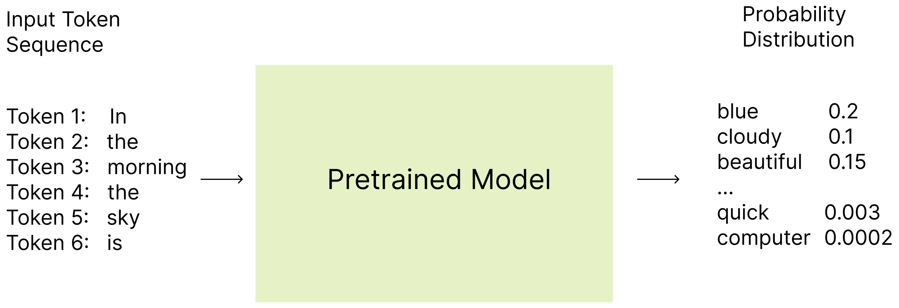

To achieve this, we start off with a large dataset of raw text. This text can be taken from books, blogs, wikis, research papers, and other text sources. After compiling the large dataset of text, we split the dataset into "chunks" of tokens, where each chunk has a certain amount of tokens (512 gpt, 1024 gpt2, 16385 gpt-3). This chunk size is known as the "context window". A pretrained model will take in that many tokens, and output the most likely next token.

#### What is a Token?
When dealing with LLMs we use the word "token" to describe the smallest "unit" of text that an LLM can analyze [5]. Tokens can generally be thought of as words conceptually. When analyzing a sequence of text, an LLM first has to convert the text to tokens. This is similar to a dictionary lookup, each word/token will have an integer "index" in the lookup. This index is what will actually be fed into the network to be analyzed.

  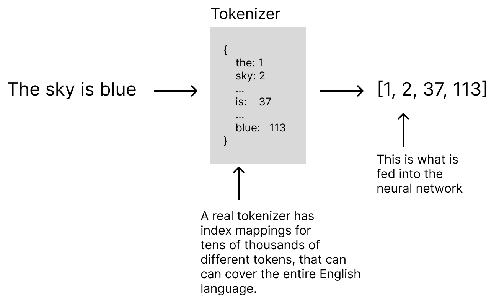

#### Pretraining Data Format
Each example of the pretraining dataset is a chunk of tokens. The same chunk of tokens is used for the input and output, but the output is shifted 1 token into the "future". The reason for this has to do with the parallel processing capabilities of the transformer, which we will go into depth further in the transformer section. The following visual helps show what the training data looks like for the pretraining model.    

  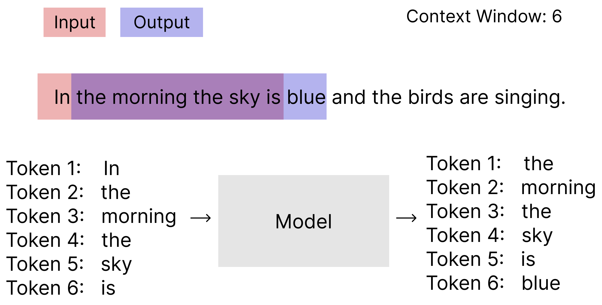

Because the model uses transformers and parallel processing, a single example like the one above is actually in a sense 6 different examples. The model is learning the following predictive patterns:   
- When input = in, output = the
- When input = in the, output = morning
- When input = in the morning, output = the
- When input = in the morning the, output = sky
- When input = in the morning the sky, output = is
- when input = in the morning, the sky is, output = blue

This will be clearer in the transformer section of the article. The main point to know now is what the format of the input and outputs of the training data should look like in the pretraining step. The outputs are the inputs, shifted by one token so that each input token aligns with the output token that comes directly after it in the original sequence.

## 1.1: Download Pretraining Dataset

Before doing a full pre-training loop, we will do a "test run" using a small dataset we can fit in to memory. This will allow us to focus on the internals of the model rather than complexities of data processing. We can use the [Salesforce wikitext](https://huggingface.co/datasets/EleutherAI/wikitext_document_level) dataset that consists of an extract of good and featured wikipedia articles [6].   

We will load the dataset from the [huggingface datasets hub](https://huggingface.co/docs/datasets/en/load_hub). The huggingface datasets package provides an easy way to load, preprocess, and use a variety of datasets for deep learning [7].

## 1.2 Tokenize & Chunk the Dataset    

For pretraining language models, a simple approach to tokenizing and chunking text is as follows:    
1. Concatenate all the text into one giant "blob". This means you have one large string.
2. Tokenize the whole blob into one list of tokens. At this point you have one large array of integers.
3. Chunk the tokens into fixed size blocks (1024, 2048, larger...) (this is the "context window"). At this point you have multiple arrays of integers, each of the same length (context size).

*This process will change slightly when using datasets that are too large to fit into memory.*

### 1.2.1 Tokenizing: Using Tiktoken

One easy way to tokenize our dataset is to use OpenAI's tokenizer implementation tiktoken for BPE (Byte Pair Encoding) [8]. This article will not go into detail on how the implementation of a tokenizer works, but just know that it converts strings of text into lists of integers, and can also convert the lists of integers back into strings of texts.

Using our tokenizer methods, we have generated a "dummy" dataset that will be used for the rest of the diagrams / examples of the article to show the shapes of the matrices as they flow through the model.    

- the input shape is $2x4$ - batch size x tokens    
- the output shape is $2x4$ - batch size x tokens    

This means that we have a context length of 4 tokens, and a batch size of 2. The full dummy dataset has a total of 2 examples. This is far smaller than the dataset would be in reality - but is useful for introducing the architecture.

## 1.3 Build the LLM

Now that we have a small dummy dataset. We can build our LLM model architecture in pytorch. 

### 1.3.1 Config Object
First, we can build a "config" object that will store our parameters for the network. We will go through each parameter in depth later on in the network.

### 1.3.2 Token Embedding Layer

  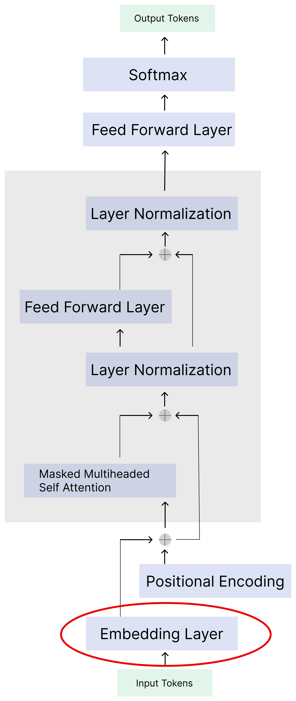

Our first layer of the network is going to be a **token embedding layer**. This layer is a little bit different than traditional neural network layers. It is essentially a lookup table that returns an "embedding vector" for a given integer index. **The goal of this layer is to convert tokens to vectors**. These vectors are tuned as the network is trained so that their position in space relative to the other tokens reflects their statistical relationships with each other.    

The embedding layer converts a discrete token (integer) into a semantic representation of that token (vector). Before the embedding layer, the model has no idea of what the token means or how it relates to other tokens. After the embedding layer, the model understands the semantic meaning of the token by its relationship with other tokens in the embedding space. For more information on word embeddings see the [Word2Vec](https://arxiv.org/pdf/1301.3781) paper [13]. 

These are vectors that start off as random, but slowly assume values within embedding space that reflect the semantic meaning of the token. This process happens during training.

  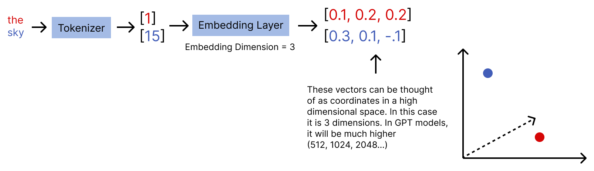

For our dummy dataset, the input to this layer will be a matrix of size $2x4$, batch x token indices. The output will be $2x4x6$, batch x tokens x embedding dimensions. This transformation can be visuzlized as follows:

  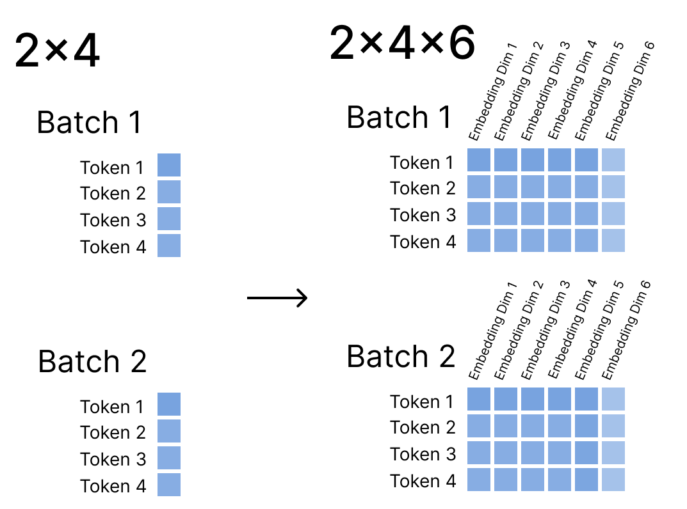

In this example, we are using an embedding dimension of 6, so each original token is mapped to a vector of length 6. As of right now, these vectors don't have any actual meaning, they are randomly initialized. However, during the training process, these entries will be slowly nudged via backpropagation and over time they will start to assume meaning for their respective tokens.

### 1.3.3 Positional Encoding Layer

  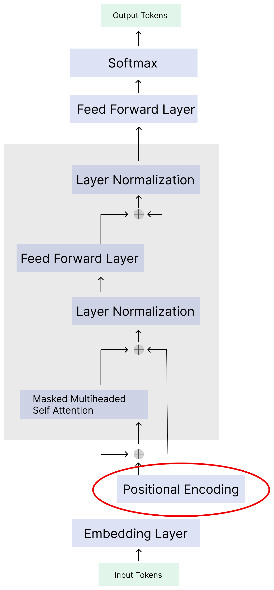

After embedding the tokens into embedding vectors, we will add a positional encoding to the vectors. Why do we need a positional encoding? Consider the following sentence:   

*The planet is smaller than the other planet.*

A positional encoding allows the model to differentiate the two instances of the word "planet". Without a positional encoding, the two token embedding vectors for each instance of the word planet would be exactly the same. Having a positional encoding allows the model to differentiate the two usages within the same instance.   

We will use the positional encoding formula that was used in the original transformer paper [9]. The formula works by starting out with a matrix of shape sequence length x embedding dimension. The matrix is then filled in with the following formula:

$$PE(POS,2i) = sin(\frac{pos}{10000^\frac{2i}{d}})$$
$$PE(POS,2i+1) = cos(\frac{pos}{10000^\frac{2i}{d}})$$

Where $POS$ is the position of the token in the sequence, i is the index of the embedding dimension within the token, and d is the embedding dimension size of the model. This entire formula outputs a matrix, and the matrix that it outputs is dependent on the embedding size. The resulting matrix will be (seq_length x embedding size). The matrix starts out as all zeros, and then the formula is applied.

Once we have the positional encoding, we add that using element wise addition to the embedding vectors. Since we are using pytorch, the addition will "broadcast" across the first dimension. This means that the 4x6 positional encoding matrix will be added to each batch example in parallel.   

  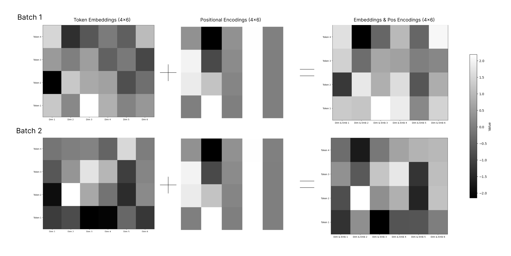

#### What is the Intuition Behind Positional Encodings?

At first, it can be a challenging to intuit what the positional encoding is doing. The positional encoding is just a constant matrix (given the sequence length and embedding size), with the values set to a desirable pattern. Each row of the matrix aligns to a token, meaning a constant vector will be added to the token at position 1 every time, and a different constant vector added to the token at position 2 every time, etc...

This differentiates the value of the word "planet" coming at the beginning vs the end of the sentence. However, sometimes relative position of words in a sentence is more important than absolute position. So how do we take that into account? The answer is that the relative relationships between words are emergent. These happen through the process of attention, which we will discuss later.

The key point here is that without positional encoding, these two sentences would look the same:   
- The dog chased the owner
- The owner chased the dog    

The positional encoding makes the vectors for dog and owner different in the two sentences, which allows attention to catch onto the relative relationships between these two words.

The below image shows an example of a positional encoding matrix. It looks interesting but what exactly are we looking at? Why does this help the model encode the position of each embedding vector. Remember, each row in our embedding vector represents a word/token. We will be adding this matrix to the embedding matrix to encode positions. One thing to note about this matrix is that each row is unique. There is also a smooth transition between each row. If you take rows 27 and 28 from this matrix, they are going to have very similar patterns. However if you take rows 1 and 120 from this matrix, they are going to differ much more. This smoothness is also an important feature that helps the model understand position [10].

  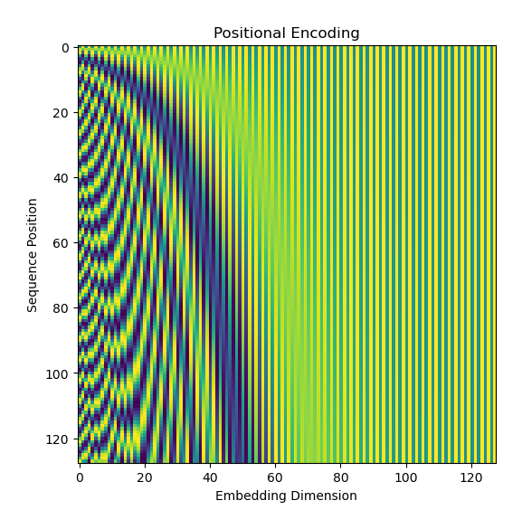

There is nothing inherently special about the formula above, there are other formulas for positional encoding. The key thing to note is that there needs to be some matrix that we can add to our embedding matrix that encodes position. This formula has certain properties that are biased towards making it easy for the model to do that.

### 1.3.4 Masked Multiheaded Self Attention

  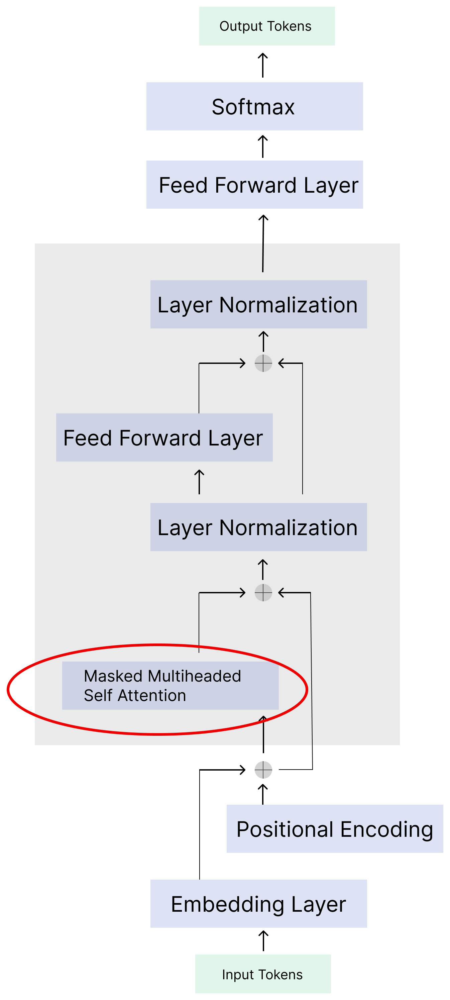

After positional encoding, we get to the core of the LLM - the (decoder only) transformer. The first step of the transformer is masked multiheaded self attention. We can break down the internals of the transformer into three parts: self attention, then masking, then the multiple heads.    

#### Self Attention
The core idea behind self attention is that it allows every token to "talk" to the other tokens. Attention "reframes" a word's meaning into a combination of all the other words in the context window. A single self attention head does one of many possible "reframings" of each token. It allows for the model to understand a each word's context in relation to the other words of the sentence.

Self attention starts with just the token embedding matrix with position encodings. It "decomposes" this matrix into queries, keys, and values. In reality all of these are just vectors / matrices that get tuned during training, but we can conceptually think of them as queries, keys, and values due to their dot product operations that take place in the attention operation.

The original equation for scaled dot product attention is as follows [9]:
$$Attention(Q,K,V)=softmax(\frac{QK^t}{\sqrt{d_k}})V$$

Q, K, and V are query, key, and value matrices. They are set initially through matrix projections of the input embedding matrix. The token embeddings are multplied by $W_q$, $W_k$, and $W_v$ matrices. These weight matrices start off as random and are tuned during the process of training the network. Meaning during training, the network learns what "queries" to ask, and what "keys" and "values" to set via backpropagation by tuning these matrices. It learns how to transform the embedding matrix into "keys", "queries", and "values" in order to best reduce the loss of the network.    

The projection operation to generate Q,K, and V are shown below using the dimensions for our dummy dataset/network.

  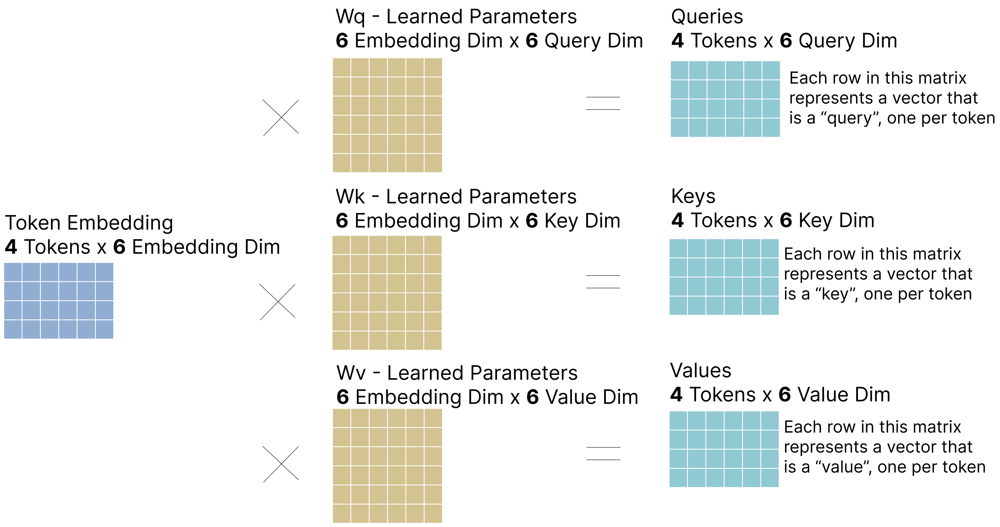

Q, K, and V are all matrices that are of shape *num tokens x embedding size*. Each token has a query vector in "query space". Each token also has a key vector in "key space". When we do the $QK^T$ operation, we are calculating how well each token query matches each key. This could be thought of as sort of a "fuzzy lookup" using vector dot products. If the query and key have a high dot product, that means the vectors are pointing in a direction near each other. This also means those two tokens are important to take into account together.    

After doing the matrix multiplication between $Q$ and $K^T$, we end up with a similarity matrix of tokens. This similarity matrix tells us how much each token attends to each other token. Each row of the $QK^T$ matrix is put through the softmax function so each row becomes a probability distribution that adds to one. This probability distribution can be interpreted as how strong of a match each key is to the query of the row. How much each key "attends" to each query.

The value matrix can be thought of the actual content/information that the each token has to offer. This value matrix is weighted by the similarities of the keys/queries to produce the final output of self attention.   

#### Self Attention: Further Intuition

There are some alternative ways to conceive of the individual operations of attention that can help at a conceptual / intuitive level to know what the network is doing. Let's go through each operation in attention and try to simplify down in english what it is doing at a conceptual level.    

##### Q, K, V Matrices Intuition
We know that the $Q$, $K$, $V$ matrices are created by a matrix operation to the input of the transformer (for the first block, this is our position encoded word embeddings). We also know that the weights to create these matrices are tuned through the process of backpropagation. But how can we think of these matrices themselves? What information do they actually contain?   

##### $Q$ Matrix Intuition

The $Q$ matrix can be thought of as n rows of queries or questions, where n is the number of tokens in the input. When thinking about the $Q$ matrix, think of it as n vectors instead of a single matrix. Where each vector is a query or question about the corresponding word that could be answered by some combinations of the other words. Remember, we are "reframing" the give word as some combination of the other words. For example it could look like the following:   

  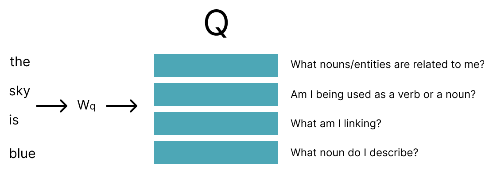

In this case each token has a corresponding question. These questions or queries are going to be questions that can be answered by the surrounding tokens. So how are these questions created? $W_q$ is responsible for creating the right questions for each token (with position). $W_q$ maps a token to a relevant query about that token. These queries become relevant through the process of training via backpropagation.    

##### $K$ Matrix Intuition
We can think of the $K$ matrix as n row vectors of keys, where n is the number of tokens in the input. What do we mean by "keys". It is easiest to think of keys as facts that can help answer queries. Above in the query section we asked questions like "what noun do I describe?". A key that might closely match this query would be "I am a noun that can be described". Similar to the queries, $W_k$ creates these keys by learning the right mapping from token to corresponding key. These keys are good matches for the queries becuase of the $QK^T$ operation that is performed in training. 

  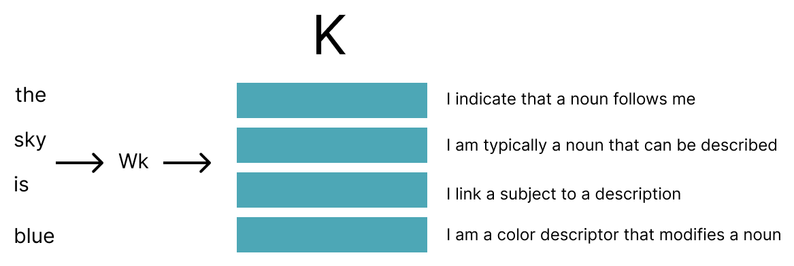

Overall, each key can be conceived of as a fact about that token that could help answer a queries that the other tokens might have. 

##### $QK^T$ Operation Intuition:

Now that we have an intuition of the $Q$ and $K$ matrix, we can think about what the matrix multiplication operation $QK^T$ in the attention equation is doing. The $QK^T$ operation is a matching  operation, where each query is compared with each key, by performing a dot product operation. If the dot product is large, that means that the key answers or "attends" to the query. If the dot product is small, that means the key is unrelated and does not help answer the query. The $QK^T$ operation "reframes" each query into a set of keys. The resulting matrix of the operation can be thought of as n row vectors. Every dimension or coordinate of these row vectors is a weight for a token key/fact. So a vector in this space is some weighted combination of all of the tokens (keys).   

Basically, what we are doing is redescribing the original token query/question as a weighted vector of all of the token keys/answers. Instead of asking a question about of token, we have n different answers, all with their own weights.    

When doing the $QK^T$ operation, we are reframing the query row vectors to a combination of the keys. Remember each query has to do with how that token relates to the other tokens, so the answers can be formed as some combination of the other tokens. 

  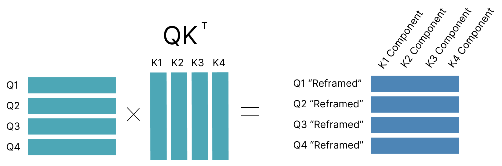

##### $\frac{QK^T}{\sqrt{d_k}}$ Operation Intuition:

This operation is done to make the output of the softmax more stable. The dot product of two random vectors of dimension $d_k$ results in values that tend to grow proportionally to $d_k$. This ensures that no matter, how large $d_k$ is, the softmax works as expected and does not result in extreme values.   

This is an elementwise division so every element of the matrix is divided by this value. The resulting matrix can be thought of in the same way as the $QK^T$ result, just scaled.

##### $softmax(\frac{QK^T}{\sqrt{d_k}})$ Operation Intuition:

The softmax operation is performed row-wise on the $\frac{QK^T}{\sqrt{d_k}}$ matrix. This means every row results in a probability distribution.
We can still think of this as each token is represented as a "reframed" query vector, but now we know that each row vector adds up to one.

##### $V$ matrix Intuition

The $V$ matrix is a bit hard to conceive of, but can be thought of as a column matrix, where each column is a learned feature, and each element of those vectors is the value of that feature for the token in that row. They are "feature" vectors, that contain information about specific learned features for each token. When we do the final operation, these feature vectors will be weighted, meaning that the values of these features for certain tokens on should be focused on more than other tokens. The $V$ matrix is the actual content or output of attention. This content will be  adjusted by the weights from the $softmax(\frac{QK^T}{\sqrt{d_k}})$ operation

  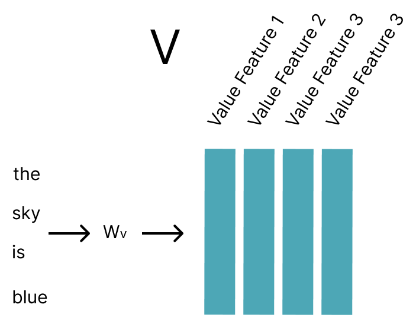

##### $softmax(\frac{QK^T}{\sqrt{d_k}})V$ Operation Intuition:

Now for the final operation of attention, multiplying by the $V$ matrix. We can think of the V matrix as containing the original content of the embeddings. We weight this content based on the query/key matches. In other words, we weight the content based on the specific questions we are trying to ask and how the other words in context answer those questions.

$$softmax(\frac{QK^T}{\sqrt{d_k}})V$$

  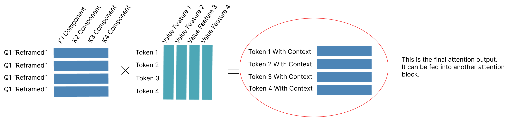

When putting this all together (using the original dimensions of our "test" config object as we are in the code), we can see what all the matrix operations and dimensions through the self attention operation are.     
   

  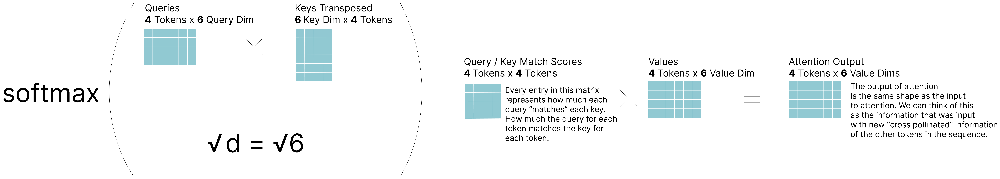

#### Self Attention: Code

Self attention can be written as a self contained pytorch module as shown below.

#### Causal Self Attention

Now that we have implemented self attention, we can move on to causal self attention. During training, we are trying to predict the next token at each time step in parallel in the transformer. However, we will be cheating if we allow attention to see future tokens during the training process. It will just predict the future tokens by looking at them. For this reason we need to mask the matrices so that future tokens are hidden from self attention layers. We perform this masking after the $QK^T$ operation [11].

  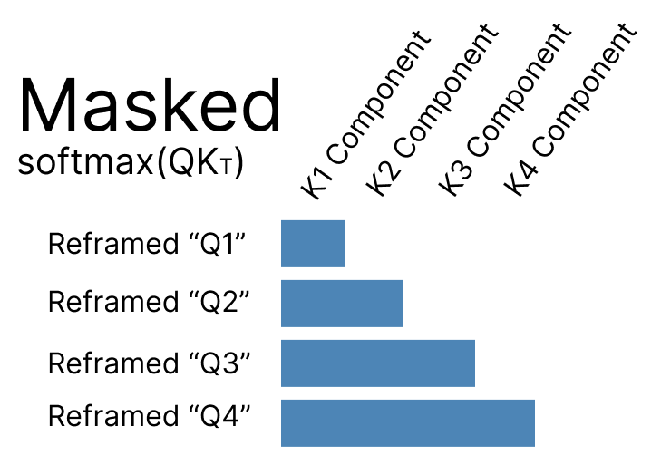

The masking process makes the output of the softmax operation 0 in the upper right corner. This makes it to where the following occurs:
- The query for token 1 is only able to be reframed as a combination of token 1
- The query for token 2 is only able to be reframed as a combination of tokens 1 and 2
- The query for token 3 is only able to be reframed as a combination of tokens 1,2, and 3
- The query for token 4 is only able to be reframed as a combination of tokens 1,2,3, and 4
- etc...

*When we say the query is able to be reframed, what we mean mathematically is that the value in that matrix entry could possibly be over 0.*

We can modify our self attention block above to add masking with the following changes:

#### Multi-Headed Causal Self Attention

Now we have causal self attention, we can add in the "multi-headed" part of the attention layer. Multi headed attention splits the attention operation in parallel, allowing multiple "heads" to each have their own learned QKV weights.

##### Multi-Headed Causal Self Attention intuition

What is this actually doing conceptually? It is allowing each head to have the tokens attend to each other in different ways. For instance one head might be focusing on grammatical structure, another might be focusing on semantic meaning, while another based on real-world meaning. If viewing the sentence "the sky is blue" from a grammatical structure perspective, the word "the" might attend to the word "sky" heavily becuase that is what it is referring to. However if viewing attention through the lense of real-world meaning, the word "the" won't attend to the word "sky" very much becuase their meanings are not similar. Each word's relationship to the other words might be different depending on what "lens" (or "head") you are viewing them through.    

To reiterate, this is a helpful conceptual way to think about multi-headed attention, but the meanings of each head is not always human understandable in this way. They are going take on whatever meaning helps minimize the loss function of the training set the most.   

The final output of Multi-Headed Causal Self Attention is the same size as the input to the self attention layer.

##### Multi-Headed Causal Self Attention Steps

Below are an outline of all the steps in multi headed causal self attention. The steps shown below will map specifically to PyTorch code in the subsequent segment. These steps are meant to help visualize what is happening in the full attention operation.

**Step 1: Multiply Input by Wqkv**  

In the above sections when referring to Wq, Wk, and Wv, we referred to them as separate matrices. While that is true and helpful conceptually, we concatenate them into one matrix to make the multi-headed self attention operation more efficient.

The first step is to multiply x by this weight matrix. This is done through a standard PyTorch linear layer. The resulting matrix will be our query, key, and value matrices concatenated.

  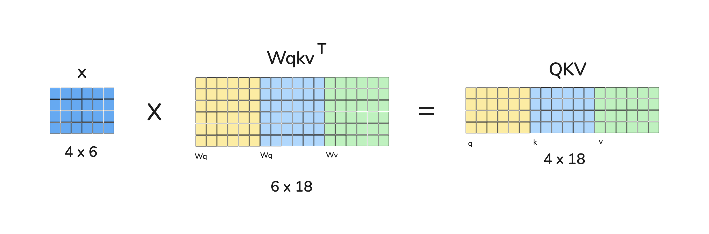

**Step 2: Split the Q, K, V Matrices**   

Using the split operation in PyTorch, we can split out the Q, K, and V matrices back to individual matrices.

  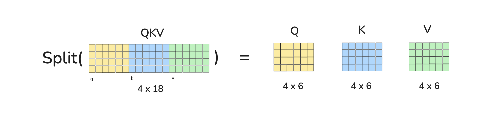

**Step 3: Reshape the Q, K, V Matrices Into Heads**    

Now that we have Q, K, and V Matrices, we can reshape them into heads. This operation should illustrate why in multi-headed self attention, it is required that the embedding dimension be divisible by the number of heads. The image below shows reshaping the Q matrix, but it should also be done for the K and V matrices in the same way.

  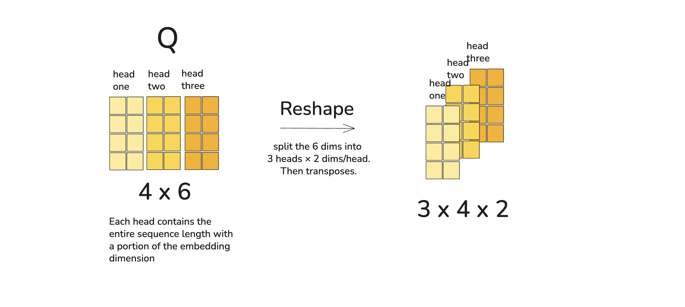

**Step 4: QK^T**   

Now we can perform the QK^T operation to get the query/key matches. This operation is the same as shown in self attention above, but now we have multiple heads. In our example we have 3 heads. All this means is that we are doing batch matrix multiplication, with the QK^T operation happening for each head in parallel. This means we have different query/key matches for each head.

  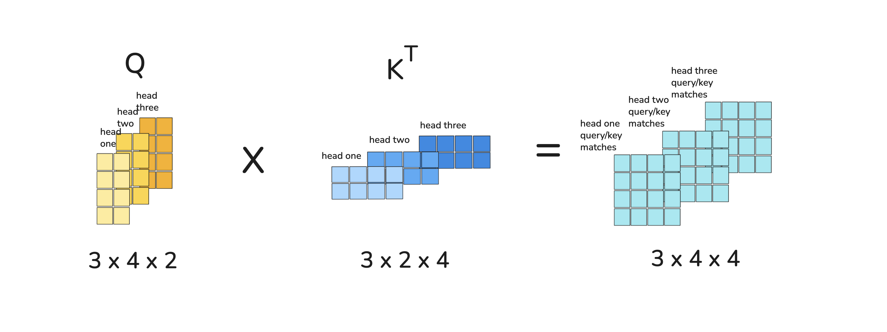

**Step 5: Mask Before Softmax**    

We take the result and apply the causal mask before softmax operation just like above. The main difference here is that the mask is applied to all 3 heads in parallel.

  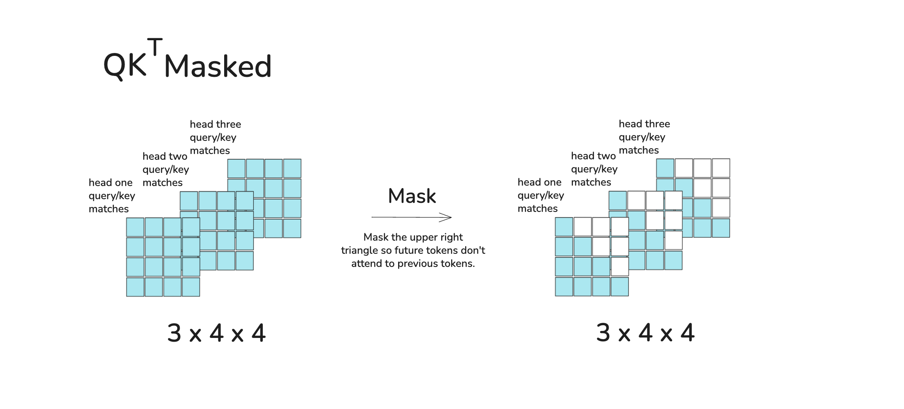

**Step 6: Softmax & Multiply by V**   

We can then normalize and multiply by V to get the attended values.

  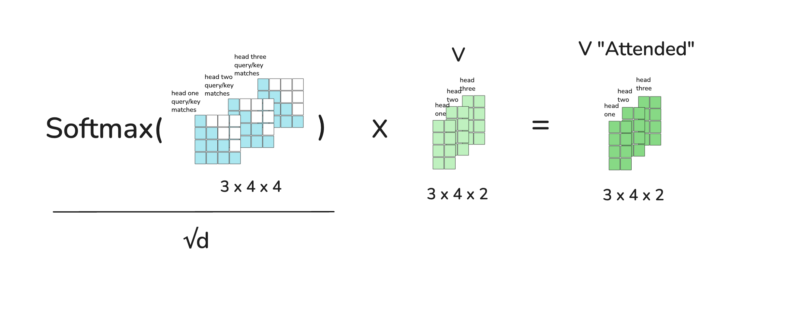

**Step 7: Merge Heads**

We now have "V attended" which has 3 heads. We can merge these back together into a single matrix before sending them through a feedforward layer.

  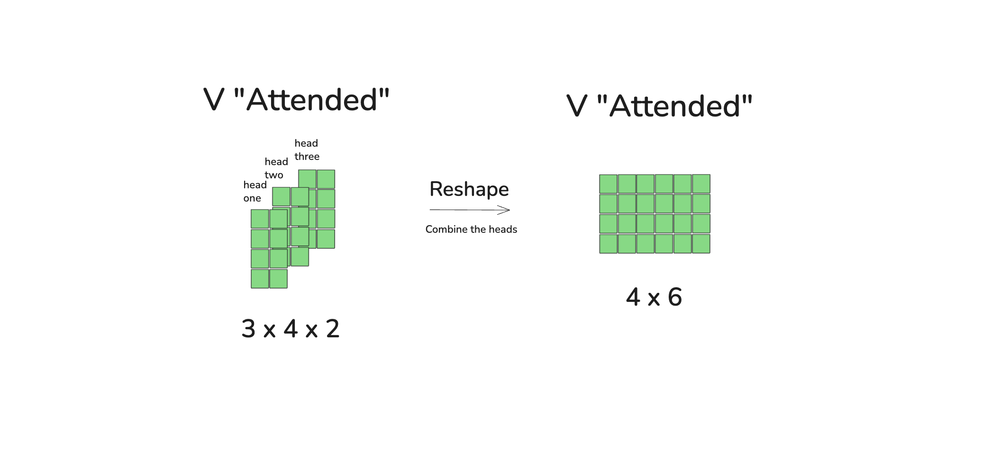

**Step 8: Projection Layer**

Finally, we feed the attended values through a linear layer, to get the final attention output. This final layer allows information to be combined and mixed between the heads, and projects the shape to match the input shape.    

The final attention output can be thought of as the input tokens, but now cross pollinated with information from their interactions with each other.

  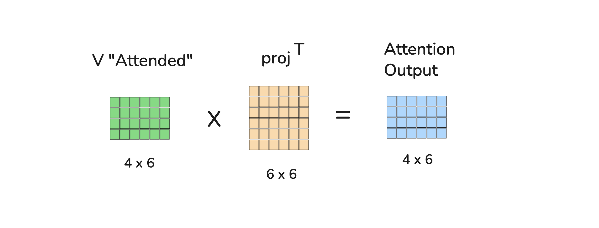

##### Multi-Headed Causal Self Attention Code

The following code snippet shows an implementation of multi-headed causal self attention, building on our previous attention blocks. This is not the most compute efficient implementation due to the for loop for each head, but it is easier to read than the fully vectorized version and works for our use case due to the small datasets we are using.

### 1.3.5 The Block

We have now succesfully implemented multi-headed attention. There are just a few steps left until we have a GPT "block" that we can stack onto the network over and over again. The architecture of a GPT block is as follows:

  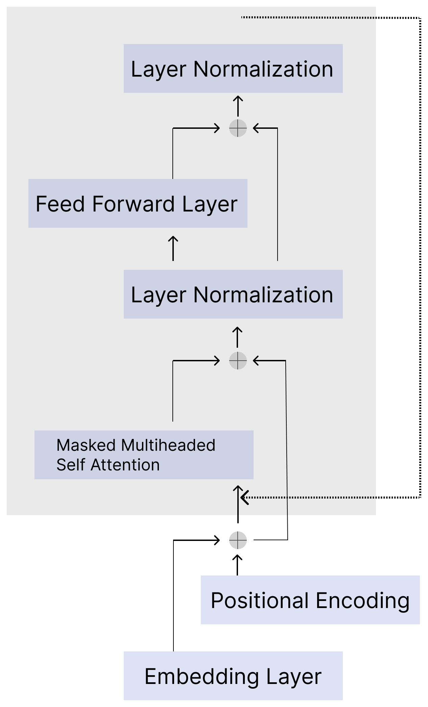

So far we have built the text embedding, positional encoding, and masked multiheaded self attention parts. Now we need to add in the normalization layers and the feedforward layers. These are straightforward pytorch layers that are common across many neural network architectures.

### Layer normalization layers
The layer normalization layers are straghtforward and used in many deep learning architectures. It normalizes the values of the incoming matrix across the feature dimension (in our case dimension 2). It is used to stabilize training and achieve faster convergence.

#### Feedforward layer
The feedforward layer of the transformer block operates with a different paradigm than attention. While attention captures relationships between tokens, the feedforward layer applies the same transformation to each token in parallel. It can be implemented using standard pytorch linear layers. We are using a factor of 4 x embedding dimension for the size of the linear layer, as was done in the original attention is all you need paper. We use the Gaussian Error Linear Unit (GELU) activation function as is implemented in the original GPT paper.

### 1.3.6 Putting it All Together

Now that we have a block, we can stack the blocks together multiple times to have a GPT style LLM model

That is a full forward pass through the LLM, the input is of shape $[batch,tokens]$ and the output is of shape $[batch,tokens,probabilities]$. For each token given in the input, the LLM will predict a discrete probability distribution of the next token that comes after that.

The transformer makes multiple predictions of this in parallel, one for each token in the input. While all of them are used in training, only the last prediction (of token n) is used in inference to to the final predition.   

The following diagram shows the full forward pass with shapes as one example moves through the matrix.

  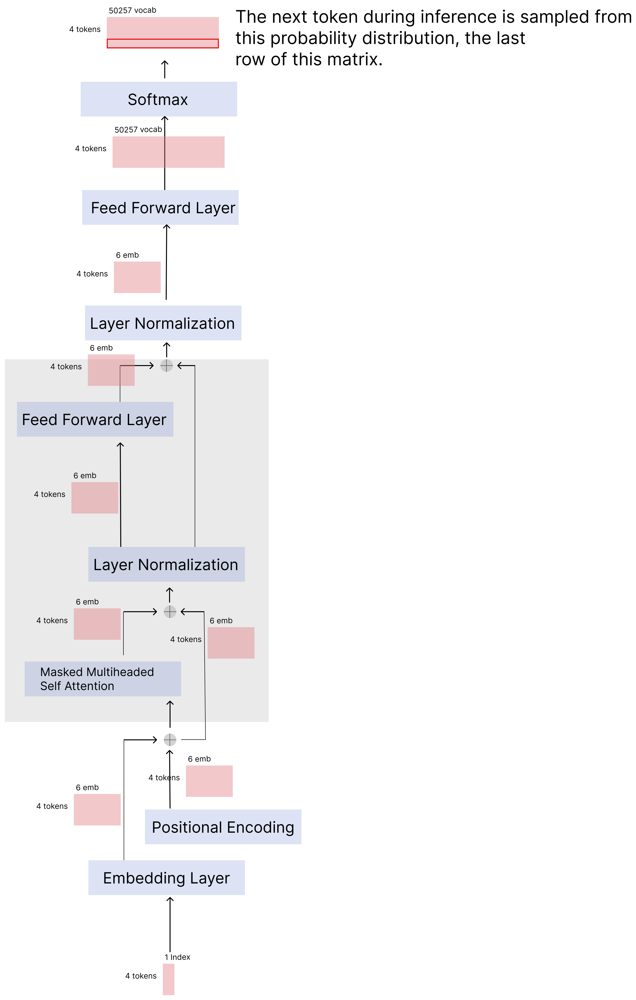

### 1.3.7 Dummy Training Loop

Now that we have gone through the forward pass of the model, we can train it. The model is trained using next token prediction

#### Objective Function

According to the original GPT paper, the objective function of pretraining is the following [1]:  

$$L1(U) = \sum_{i}logP(u_i|u_{i-k}...u_{i-1};\theta)$$

- $U$ is the sequence of text (tokens) we are computing the objective function for
- $u_i$ is the current token of the sequence
- $u_{i-k}...u_{i-1}$ are the previous k tokens (context window)
- $P(u_i|u_{i-k}...u_{i-1};\theta)$ is the probability of predicting $u_i$ given the previous tokens $u_{i-k}...u_{i-1}$ and the models's parameters $\theta$
- We take the log of this value for its useful properties in optimization
- We then take the sum across all the tokens in the sequence
- Therefore, in english, we can find the probability of predicting a token based on the previous k tokens and the models weights. We want to maximize this probability across all the tokens in the sequence.

Maximizing this objective function is essentially the same as minimizing the cross entropy loss function.

$$H(p, q) = -\sum_{x} p(x) \log q(x)$$

- Where p(x) is the true class discrete probability distribution 
- q(x) is the predicted class discrete probability distribution

This is becuase during training, we use a one hot encoded vector for the true distribution, so p(x) is 1 for the correct token, and 0 for all other tokens. This means we can remove the sum and simplify the cross entropy loss to this:

$$H(p, q) = -\log P(u_i \mid u_{i-k}, \dots, u_{i-1}; \theta)$$

Pytorch has a pre-built cross-entropy loss function that can be used as our criterion to minimize [12].

#### Test One: Overfitting
We will first train the model with a small dataset (10 examples) and see if we can get the model to memorize/overfit to the dataset. This is a good test to ensure that our architecture is correct and getting the loss to reduce as expected.

### 1.3.8 Test Two: Memorization

To perform inference, we can autoregressively feed data into the transformer, sliding the selected output token back into the input. We can test this on one of our training examples and see that our model is accurately reproducing the training example. The model has been overfit to the data, so we are testing if the model reproduces the correct outputs in the same order as the inputs.

## 1.4 Real Training Loop

Using tiktoken, and a small dataset, we were able to overfit a small dataset and perform inference examples. However, in order to train a LLM that can do useful things we will need a larger dataset that won't be able to fit in memory. We will also need an efficient way to tokenize the dataset and load it into pytorch tensors.

### 1.4.1 Huggingface Streaming Dataset
Huggingface's datasets library makes this process very easy.

### 1.4.2 Modified Training Loop
We have tokenized the dataset in chunks, and saved it to the disk as a parquet file. This is a scalable approach that will allow us to train the model while never having the entire dataset in memory. Let's make a more robust training loop that ensures we are saving off the model at various checkpoints.

### 1.4.3 Inference with Pretrained Model

Now that we have pretrained the model, we can perform some inference examples to see what types of outputs we get from the model. We can see that the model is able to output legible english, and most of the words make sense, however, its size limits make it not quite as robust as larger models. It is still good enough to see the "sparks" of understanding language.

In this dataset, we trained on news articles so I've started the sentences with phrases that could potentially be found in the news. If you rerun the cell below this you will see that you get different outputs every time. This is due to the randomness of the next token selection step.

# 2: Supervised Fine Tuning   
To make the model more useable, we can take the pretrained model, and then go through a process called supervised fine tuning. This process involves having high quality supervised text datasets to get the model to respond how we want.

We can use the [Fact Q&A](https://huggingface.co/datasets/rubenroy/GammaCorpus-Fact-QA-450k?library=datasets) dataset from huggingface for this. This dataset consists of question - answer examples that are short, which is good for our use case since we have a small context window of 128 tokens.

Supervised fine tuning is where we can introduce "tags" and other types of text tokens that can help the model understand different roles in the text. For our dataset, we will have a "question" tag and an "answer" tag. We will add all of these when we create our dataset, and also during inference when a user submits a query. We also add eos tokens to end/pad the examples that do not take up the full context window.

After fine tuning on this dataset, ideally we will have a LLM that you can ask a question and get an answer.

### 2.1 Supervised Fine Tuning Training Loop

A very similar training loop can be used for supervised fine tuning.

### 2.2 Inference with Fine Tuned Model

With the fine tuned model, we can perform a more natural form of interence. Instead of formatting all of our prompts as next token prediction, we can have a more natural Q&A style format with the model    

We are using a very small model and a very small set of data compared to modern LLMs, so our model is not going to perform very well on most questions. However, it is outputting responses that are at least related to the prompt and are formatted in a correct way. It is very cool to see the LLM starting to come together! As we scale up the model, data, etc... the responses will become more factual, realistic, and contextually accurate. At this point, the majority of the responses are hallucinations.

# Sources
- [1] [Improving Language Understanding by Generative Pretraining (GPT)](https://cdn.openai.com/research-covers/language-unsupervised/language_understanding_paper.pdf)
- [2] [Pytorch](https://pytorch.org/)
- [3] [Language Models are Unsupervised Multitask Learners (GPT2)](https://cdn.openai.com/better-language-models/language_models_are_unsupervised_multitask_learners.pdf)
- [4] [Language Models are Few-Shot Learners (GPT3)](https://arxiv.org/pdf/2005.14165)
- [5] [Tokenization](https://nlp.stanford.edu/IR-book/html/htmledition/tokenization-1.html)
- [6] [Salesforce Wikitext](https://huggingface.co/datasets/EleutherAI/wikitext_document_level)
- [7] [Huggingface Datasets](https://huggingface.co/docs/datasets/en/index)
- [8] [Tiktoken](https://github.com/openai/tiktoken)
- [9] [Attention is All You Need](https://arxiv.org/pdf/1706.03762)
- [10] [Gentle Introduction to Positional Encoding](https://machinelearningmastery.com/a-gentle-introduction-to-positional-encoding-in-transformer-models-part-1/)
- [11] [How Do Self-Attention Masks Work?](https://gmongaras.medium.com/how-do-self-attention-masks-work-72ed9382510f)
- [12] [CrossEntropyLoss](https://pytorch.org/docs/stable/generated/torch.nn.CrossEntropyLoss.html)
- [13] [Word2Vec](https://arxiv.org/pdf/1301.3781)
- [14] [nanoGPT](https://github.com/karpathy/nanoGPT)
- [15] [3blue1brown: Attention in Transformers](https://www.youtube.com/watch?v=eMlx5fFNoYc&t=1s)
